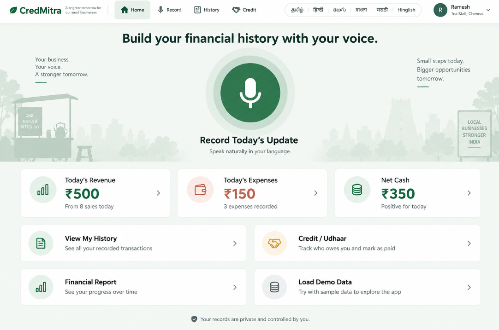
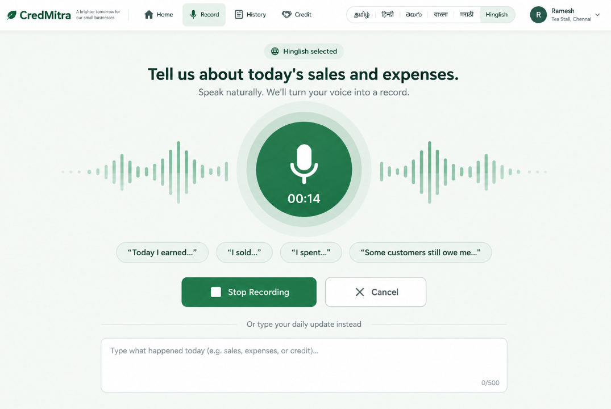
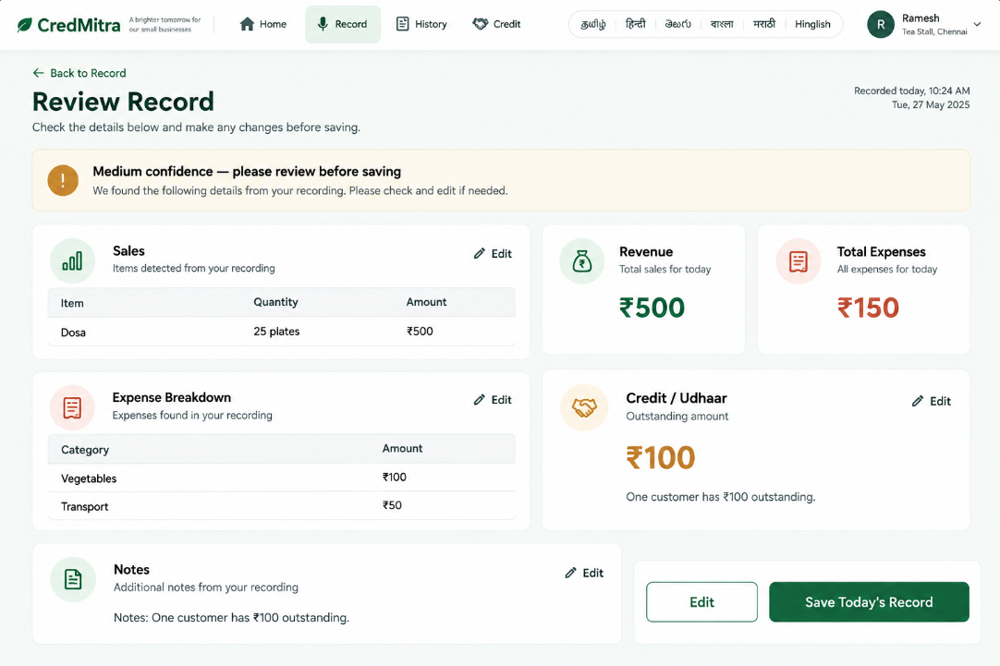

# CredMitra - Voice-First Financial Record & Udhaar Tracker

CredMitra is a voice-first financial ledger and Udhaar manager designed for local vendors and shopkeepers. It converts spoken daily sales and expense updates into structured visual records—combining the trustworthiness of a modern fintech app with the ease of talking.

---

## UI Prototype Showcase

### 1. Home Screen
Voice-first interface with daily sales & expense summary.

### 2. Record Screen
Speech recording screen with real-time audio waveform.

### 3. Review Record Screen
Verification step to review transcribed numbers before saving.

### 4. Credit / Udhaar Screen
Per-person customer balance cards with pending and paid payment tags.

---

## Key Features

- **Voice-First Data Entry:** Speak sales, expenses, and credit updates in natural language instead of typing.
- **Instant Audio Verification:** Review transcribed spoken records before saving to maintain 100% financial accuracy.
- **Per-Person Udhaar Cards:** Visual breakdown of outstanding debts with direct action items.
- **Clean Fintech Interface:** Designed with a familiar green-and-white visual palette for maximum clarity and trust.
